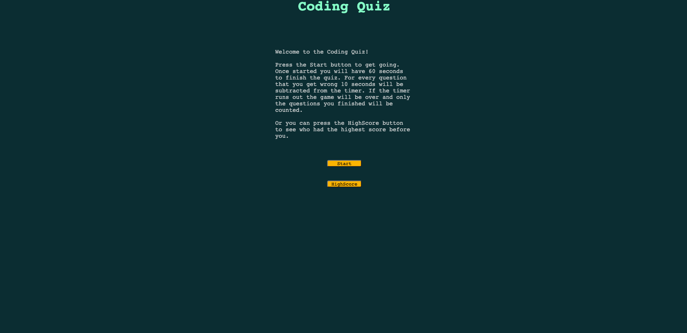

# homework_week_4
 

## Objective
  The objective of this project was to work with taking in user input, buttons and localStorage.
 
 

## Requirements
* Start button starts the timer and shows the first question
* When a question is answered the next one apears
* If the answer is incorrect then time is subtracted from the timer
* When all questions have been answered or the timer has ran out, the game is over
* When the game ends the user can input their name
* The name and score must be saved to localStorage
* The user must be able to look at the previous highscore
 
 

## Screenshot

 
 

## Link
[page](https://kevinhenleycode.github.io/homework_week_4/)
 
 